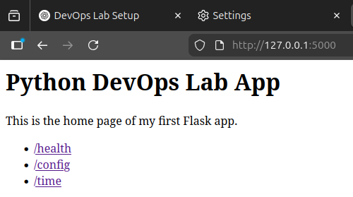

# Python Flask DevOps Lab

A small Python Flask web application built as a DevOps training project.

## Objective

Build a simple Python web app, run it locally in an isolated virtual environment, then package it into a Docker image and run it as a containerized service.

## Features

- `GET /` - home page
- `GET /health` - health status endpoint
- `GET /config` - runtime configuration from environment variables
- `GET /time` - current UTC and Sofia time

## Project Structure

```text
python-flask-devops-lab/
├── app/
│   ├── app.py
│   └── requirements.txt
├── Dockerfile
├── .dockerignore
├── .gitignore
└── README.md
```

## Screenshot

Application running locally in the browser:



## Local Run

```bash
cd ~/python-flask-devops-lab
source .venv/bin/activate
python app/app.py
```

The application should then be reachable at:

- `http://127.0.0.1:5000`
- `http://localhost:5000`

## Environment Variables

The app supports the following runtime environment variables:

- `APP_ENV` - application environment
- `APP_VERSION` - application version

Example:
```bash
APP_ENV=local APP_VERSION=1.0.0 python app/app.py
```

## Docker Build

```bash
cd ~/python-flask-devops-lab
docker build -t python-flask-devops-lab .
```

## Docker Run

```bash
docker run -p 5000:5000 python-flask-devops-lab
```

The containerized application should then be reachable at:

- `http://127.0.0.1:5000`


## What I Learned

1. How to isolate Python dependencies with `venv`
2. How to build a small Flask web app with multiple endpoints
3. How to capture dependencies in `requirements.txt`
4. How to package an app and its dependencies into a Docker image
5. The difference between a Docker image and a running container
6. How local app execution differs from containerized execution

## Troubleshooting Highlights

1. Fixed Python interpreter mismatch between system Python and `.venv`
2. Resolved `No module named flask`
3. Corrected missing `UTC` import
4. Removed duplicate Flask route definition
5. Clarified the difference between local port binding and Docker port publishing

# GitHub Repository

- Project Code: https://github.com/imusofer/python-flask-devops-lab
- Knowledge Base / Notes: https://github.com/imusofer/devops-vault